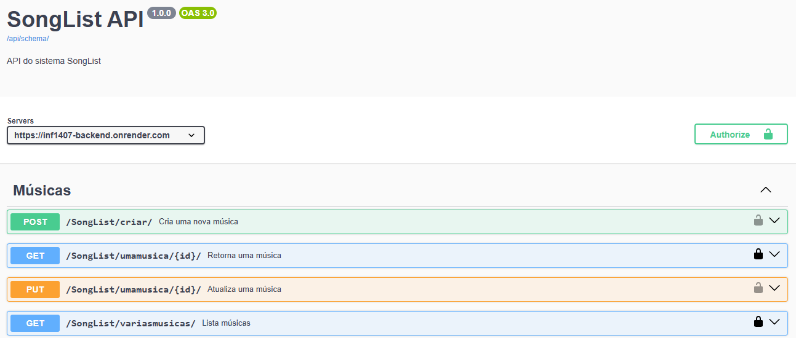

# SongList — Backend

Trabalho 2 de **INF1407 – Programação para Web** (PUC-Rio, 2026/1).
Backend em Django + Django REST Framework que serve a API REST consumida pelo frontend [INF1407-TRABALHO2-FRONTEND](https://github.com/MaluDutra/INF1407-TRABALHO2-FRONTEND).

## Autoria

- Érica Régnier
- Maria Luiza Dutra

## Descrição do projeto

O **SongList** é um catálogo colaborativo de músicas. Usuários autenticados podem cadastrar, editar e remover músicas do acervo, enquanto visitantes podem apenas visualizar a lista. O backend expõe uma API REST documentada via Swagger, autenticação por JWT e um fluxo completo de gerência de usuário (cadastro, login, troca de senha e recuperação por código).

A base inicial de músicas é populada automaticamente a partir da [iTunes Search API](https://performance-partners.apple.com/search-api) por meio de um comando de management próprio.

## Links

- **API em produção:** <https://inf1407-backend.onrender.com/>
- **Documentação Swagger:** <https://inf1407-backend.onrender.com/swagger/>
- **Documentação ReDoc:** <https://inf1407-backend.onrender.com/redoc/>
- **Schema OpenAPI (JSON):** <https://inf1407-backend.onrender.com/api/schema/>
- **Repositório do frontend:** <https://github.com/MaluDutra/INF1407-TRABALHO2-FRONTEND>

## Tecnologias

- Python 3 + Django 6
- Django REST Framework
- djangorestframework-simplejwt (autenticação JWT)
- drf-spectacular (Swagger / OpenAPI 3)
- django-cors-headers (CORS para o frontend hospedado em outro domínio)
- SQLite (banco de dados)
- Gunicorn (servidor de produção no Render)

## Instalação local

### Pré-requisitos

- Python 3.10 ou superior
- `pip` e `venv`

### Passo a passo

```bash
# 1. Clonar o repositório
git clone https://github.com/MaluDutra/INF1407-TRABALHO2-BACKEND.git
cd INF1407-TRABALHO2-BACKEND

# 2. Criar e ativar o ambiente virtual
python -m venv .venv
source .venv/bin/activate        # Linux / macOS / WSL
# .venv\Scripts\activate         # Windows PowerShell

# 3. Instalar as dependências
pip install -r requirements.txt

# 4. Aplicar as migrations
python manage.py makemigrations
python manage.py migrate

# 5. (Opcional) Popular o banco com músicas da iTunes API
python manage.py populate_songs

# 6. (Opcional) Criar um superusuário para acessar o admin
python manage.py createsuperuser

# 7. Rodar o servidor
python manage.py runserver
```

Depois disso, a API fica disponível em <http://localhost:8000/> e o Swagger em <http://localhost:8000/swagger/>.

### Variáveis de ambiente (opcional)

Para personalizar, crie um arquivo `.env` na raiz do projeto:

```env
SECRET_KEY=sua-chave-secreta
DEBUG=True
EMAIL_HOST=smtp.gmail.com
EMAIL_PORT=587
EMAIL_HOST_USER=seu@email.com
EMAIL_HOST_PASSWORD=sua-senha-de-app
DEFAULT_FROM_EMAIL=seu@email.com
```

Sem o `.env`, o backend usa configurações padrão e envia emails de recuperação de senha para o console.

## Estrutura do projeto

```
INF1407-TRABALHO2-BACKEND/
├── Lists/                  # Projeto Django (settings, urls, utils)
│   ├── settings.py
│   ├── urls.py
│   └── utils.py            # Detecção automática de ambiente
├── SongList/               # App de músicas (CRUD)
│   ├── models.py
│   ├── serializers.py
│   ├── views.py
│   ├── urls.py
│   └── management/
│       └── commands/
│           └── populate_songs.py
├── gerenciamento/          # App de gerência de usuário
│   ├── models.py           # PasswordResetCode
│   ├── serializers.py
│   ├── views.py
│   ├── urls.py
│   └── templates/email/    # Templates do email de recuperação
├── requirements.txt
└── manage.py
```

## Endpoints da API

### Autenticação

| Método | Endpoint                | Descrição                              | Auth |
| ------ | ----------------------- | -------------------------------------- | ---- |
| POST   | `/api/token/`           | Obtém par de tokens JWT (access + refresh) | Não |
| POST   | `/api/token/refresh/`   | Renova o token de acesso               | Não  |
| POST   | `/api/token/verify/`    | Verifica se um token é válido          | Não  |

### Músicas (CRUD)

| Método | Endpoint                              | Descrição                          | Auth |
| ------ | ------------------------------------- | ---------------------------------- | ---- |
| GET    | `/SongList/variasmusicas/`            | Lista todas as músicas             | Não  |
| POST   | `/SongList/criar/`                    | Cria uma nova música               | Sim  |
| GET    | `/SongList/umamusica/<id>/`           | Retorna uma música específica      | Não  |
| PUT    | `/SongList/umamusica/<id>/`           | Atualiza uma música                | Sim  |
| DELETE | `/SongList/variasmusicas/`            | Remove uma lista de IDs            | Sim  |

### Gerência de usuário

| Método | Endpoint                              | Descrição                                | Auth |
| ------ | ------------------------------------- | ---------------------------------------- | ---- |
| GET    | `/gerenciamento/whoami/`              | Retorna o usuário autenticado            | Sim  |
| POST   | `/gerenciamento/register/`            | Cadastra um novo usuário                 | Não  |
| PUT    | `/gerenciamento/change-password/`     | Altera a senha do usuário autenticado    | Sim  |
| POST   | `/gerenciamento/password-reset/`      | Solicita um código de redefinição        | Não  |
| PUT    | `/gerenciamento/password-reset/`      | Confirma a redefinição com código + senha| Não  |

### Documentação

| Endpoint        | Descrição                          |
| --------------- | ---------------------------------- |
| `/swagger/`     | Interface Swagger UI               |
| `/redoc/`       | Interface ReDoc                    |
| `/api/schema/`  | Schema OpenAPI 3 em JSON           |
| `/admin/`       | Admin do Django                    |

## Como usar a API

### 1. Cadastrar um usuário

```bash
curl -X POST https://inf1407-backend.onrender.com/gerenciamento/register/ \
  -H "Content-Type: application/json" \
  -d '{"username":"maria","email":"maria@exemplo.com","password":"SenhaForte123!","password_confirm":"SenhaForte123!"}'
```

### 2. Fazer login e obter o token JWT

```bash
curl -X POST https://inf1407-backend.onrender.com/api/token/ \
  -H "Content-Type: application/json" \
  -d '{"username":"maria","password":"SenhaForte123!"}'
```

A resposta contém os campos `access` e `refresh`.

### 3. Criar uma música (precisa de autenticação)

```bash
curl -X POST https://inf1407-backend.onrender.com/SongList/criar/ \
  -H "Content-Type: application/json" \
  -H "Authorization: Bearer SEU_TOKEN_DE_ACESSO" \
  -d '{"titulo":"Bohemian Rhapsody","artista":"Queen","album":"A Night at the Opera","ano":1975}'
```

### 4. Listar todas as músicas (público)

```bash
curl https://inf1407-backend.onrender.com/SongList/variasmusicas/
```

Pela interface do Swagger é possível autenticar clicando em **Authorize** e colando o token no formato `Bearer SEU_TOKEN`, e em seguida testar todos os endpoints diretamente do navegador.

## Capturas de tela

### Documentação Swagger



### Endpoint de listagem de músicas


### Fluxo de autenticação


> As imagens ficam em `docs/` na raiz do repositório.

## O que funcionou

- CRUD completo das músicas (listar, criar, ler por id, atualizar, deletar em lote)
- Autenticação JWT com obtenção, renovação e verificação de tokens
- Endpoints protegidos exigindo token válido (criar, atualizar e deletar músicas)
- Cadastro de novo usuário
- Troca de senha do usuário autenticado
- Solicitação de código de recuperação de senha (gera código e tenta enviar email)
- Confirmação de recuperação de senha com código
- Documentação Swagger com `extend_schema`, exemplos e tags
- Comando `populate_songs` puxando músicas da iTunes Search API
- Deploy no Render com HTTPS funcionando
- Detecção automática de ambiente (Local, Codespace, Render) ajustando domínio e protocolo no Swagger

## O que não funcionou

- **Envio real de email de recuperação de senha no Render.** Em produção (no render.com) não há um servidor SMTP configurado gratuitamente, então o email não chega na caixa do usuário. Como solução de contorno, preferiu-se enviar o email de recuperação de senha pelo próprio console no render.com, com `EMAIL_BACKEND` apontando para o console e o token aparecendo no terminal.
- O método `DELETE /SongList/variasmusicas/` não é exibido com o corpo da requisição no Swagger, porque o `drf-spectacular` não suporta descrever request body em DELETE (limitação documentada da biblioteca).